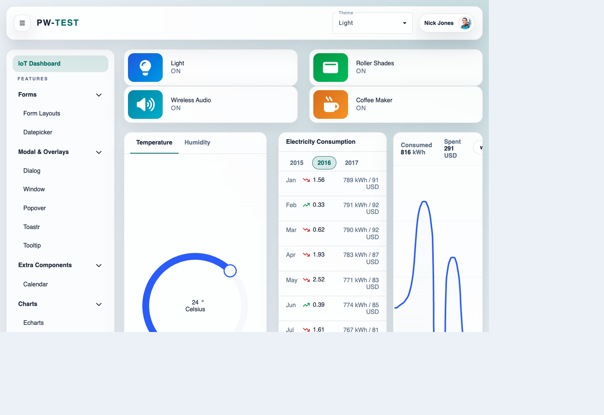
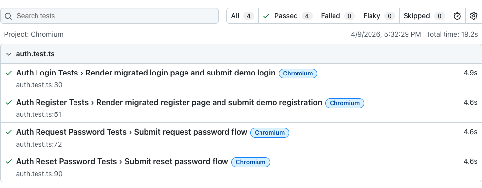

# Playwright Playground

[](https://github.com/tryb3l/playwright-playground/actions/workflows/playwright.yml)


The app under test lives in [`app/`](app/). The Playwright project lives in [`e2e/`](e2e/). Keeping both in one repo makes the delivery choices inspectable end to end: page and component abstractions, typed fixtures, CI-aware configuration, and failure diagnostics that stay useful after a test breaks.

<p align="center">
  
  
</p>

## What This Project Proves

- A realistic browser suite can stay readable when fixtures, page objects, components, and assertions are treated as first-class architecture instead of ad hoc helpers.
- CI behavior can be part of the design, not an afterthought: browser matrix, retries, server reuse, environment loading, traces, screenshots, and artifact publishing are all configured from the same surface.
- Frontend failures become faster to debug when console and network noise are captured automatically and attached to the test result.

If you are evaluating this as portfolio work, the strongest signals are in the linked implementation files below. If you are evaluating delivery fit for client work, the short version is this: the project is designed to reduce the two most common UI automation problems, brittle tests and low-signal failures.

## Proof In The Codebase

### 1. Typed shared fixtures with auth-state reuse

[`e2e/lib/fixtures/base-fixtures.ts`](e2e/lib/fixtures/base-fixtures.ts) extends Playwright's base `test` with a shared contract for:

- `pageManager`
- `assertions`
- generated user credentials
- optional authenticated browser contexts
- automatic console and network tracking

When `REUSE_AUTH` is enabled and a saved auth file exists, the suite can reuse `playwright/.auth/user.json`; otherwise it creates a fresh authenticated context and persists it for later runs.

If you want to load fixed login credentials from JSON, use `USE_USER_FROM_FILE=true` together with `USER_CREDENTIALS_FILE=/absolute/or/relative/path/to/user-credentials.json`. The generated `playwright/.auth/user.json` storage-state file is not a credentials source.

### 2. CI-aware configuration from one place

[`playwright.config.ts`](playwright.config.ts) and [`e2e/lib/utils/config-helpers.ts`](e2e/lib/utils/config-helpers.ts) centralize the execution rules:

- default env loading from `.env.dev` with `ENV_FILE` override support
- `BASE_URL` override support
- auto-starting the Angular app from `app/`
- local server reuse outside CI
- `forbidOnly`, retry count, and worker count changes in CI
- explicit Chromium and Firefox project setup

That keeps local and CI execution close enough to compare, while still tightening behavior where CI needs it.

### 3. Failure diagnostics that do more than attach a screenshot

[`e2e/lib/utils/observability-report.ts`](e2e/lib/utils/observability-report.ts) and the teardown logic in [`e2e/lib/fixtures/base-fixtures.ts`](e2e/lib/fixtures/base-fixtures.ts) turn captured console and network issues into a plain-text report attached to the test result.

The shared fixture then fails the test after the evidence is attached. That is a materially better debugging experience than seeing a red test with no direct clue whether the problem came from the UI flow, a console exception, or a failed network response.

### 4. Reusable navigation and assertion surfaces

[`e2e/pages/page-manager.ts`](e2e/pages/page-manager.ts) provides typed access to page objects plus start-page navigation. [`e2e/lib/utils/assertions/assertion-factory.ts`](e2e/lib/utils/assertions/assertion-factory.ts) exposes domain assertions for forms, date pickers, tables, and toastr flows.

That split matters: tests stay focused on intent, while navigation and verification logic stay reusable and easier to change when the UI moves.

### 5. Component and page composition instead of selector sprawl

The suite separates reusable fragments in [`e2e/lib/components/`](e2e/lib/components/) from page-level orchestration in [`e2e/pages/`](e2e/pages/). This is the difference between a portfolio demo that happens to pass and a framework that can absorb future UI churn without rewriting every spec.

## Coverage Overview

There are 12 feature-level specs in [`e2e/tests/`](e2e/tests/), covering a broad cross-section of the UI surface:

- Authentication: [`e2e/tests/auth.test.ts`](e2e/tests/auth.test.ts)
- Dashboard state and widgets: [`e2e/tests/dashboard.test.ts`](e2e/tests/dashboard.test.ts)
- Theme switching: [`e2e/tests/theme-switcher.test.ts`](e2e/tests/theme-switcher.test.ts)
- Forms: [`e2e/tests/form-layouts.test.ts`](e2e/tests/form-layouts.test.ts)
- Date pickers and calendars: [`e2e/tests/datepicker.test.ts`](e2e/tests/datepicker.test.ts), [`e2e/tests/calendar.test.ts`](e2e/tests/calendar.test.ts)
- Dialogs, windows, and toast feedback: [`e2e/tests/dialog.test.ts`](e2e/tests/dialog.test.ts), [`e2e/tests/window.test.ts`](e2e/tests/window.test.ts), [`e2e/tests/toastr.test.ts`](e2e/tests/toastr.test.ts)
- Data-heavy UI: [`e2e/tests/smart-table.test.ts`](e2e/tests/smart-table.test.ts), [`e2e/tests/tree-grid.test.ts`](e2e/tests/tree-grid.test.ts)
- Charts: [`e2e/tests/echarts.test.ts`](e2e/tests/echarts.test.ts)

This is not positioned as API coverage, visual regression coverage, or performance benchmarking. It is a browser-E2E portfolio focused on maintainable UI coverage and actionable failures.

## Quick Start

Install both dependency sets, install Playwright browsers, then run the suite:

```bash
npm install
npm install --prefix app
npx playwright install --with-deps
npm run test:e2e
```

Useful follow-up commands:

```bash
npm start --prefix app
npm run test:e2e:debug
npm run test:e2e:parallel
npx playwright show-report
```

Notes:

- [`package.json`](package.json) wires `npm run test:e2e` to clean port `4200`, typecheck, and run Playwright.
- [`e2e/lib/utils/config-helpers.ts`](e2e/lib/utils/config-helpers.ts) starts the app automatically with `npm start` in `app/`, so a separate local server is optional for test runs.
- [`playwright.config.ts`](playwright.config.ts) loads `.env.dev` by default and supports overriding the env file with `ENV_FILE`.

## CI And Reporting

[`.github/workflows/playwright.yml`](.github/workflows/playwright.yml) currently:

- runs on pushes and pull requests targeting `main` and `master`
- installs app dependencies and root dependencies separately
- installs Playwright browsers with `--with-deps`
- runs `node --run test:e2e`
- uploads the HTML report from `playwright-report/` for 30 days

Combined with the config helpers, that gives the suite a practical reporting stack:

- HTML report for run-level browsing
- screenshots on failure
- traces on first retry
- optional observability attachment when console or network issues are captured

## Selected Structure

```text
app/                         Angular application under test
e2e/
  lib/
    components/              Reusable UI interaction layer
    fixtures/                Shared Playwright fixtures and test options
    utils/                   Config, auth, assertions, observability
  pages/                     Page objects and navigation manager
  tests/                     Feature-level specs
playwright.config.ts         Root config and env loading
.github/workflows/          CI execution and report artifact upload
docs/e2e/REQUIREMENTS.md    Documentation target for the E2E project
```

## Why This Matters In Client Work

The value here is practical rather than abstract.

- Maintainable abstractions reduce the cost of UI churn.
- CI-ready diagnostics shorten the path from failure to fix.
- Co-locating the app and the tests makes assumptions visible during framework upgrades, design-system changes, and feature work.

That is the kind of automation I aim to ship on real teams: readable enough to extend, strict enough to trust, and instrumented enough to debug without guesswork.

## License

This project is licensed under the MIT License. See [`LICENSE`](LICENSE) for details.
